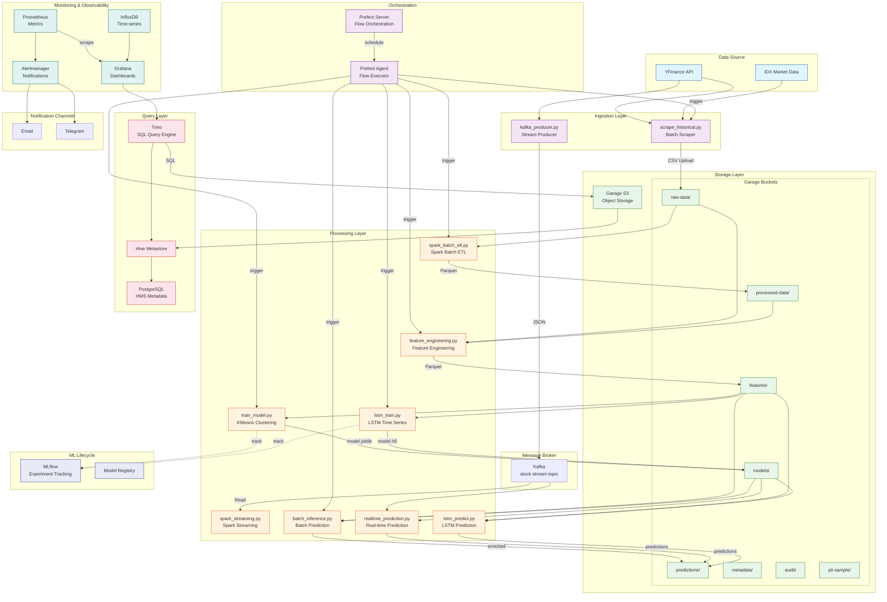

# Arsitektur Pipeline - Real-time Ticker & Prediksi Saham

## Diagram Arsitektur



## Alur Data

### 1. Batch Pipeline
```
[YFinance] --scrape--> [CSV] --upload--> [Garage: raw-data/]
    --> [Spark ETL] --transform--> [Garage: processed-data/]
```

### 2. Stream Pipeline
```
[YFinance] --kafka-producer--> [Kafka: stock-stream-topic]
    --> [Spark Streaming] --aggregate--> [Console / Garage]
```

### 3. ML Pipeline (KMeans)
```
[Garage: raw-data/] --feature-engineering--> [Garage: features/]
    --KMeans training--> [Garage: models/kmeans_*.joblib]
    --batch-inference--> [Garage: predictions/ (enriched)]
```

### 4. ML Pipeline (LSTM)
```
[Garage: raw-data/] --feature-engineering--> [Garage: features/]
    --LSTM training--> [Garage: models/lstm_ihsg_*.h5]
    --LSTM predict--> [Garage: predictions/lstm/]
```

### 5. ML Lifecycle (MLflow)
```
[Training] --log params/metrics--> [MLflow Tracking]
[Best model] --register--> [MLflow Model Registry]
[Model] --artifact--> [Garage: mlflow/]
```

### 6. Orchestration (Prefect)
```
[Prefect Server] --schedule--> [Prefect Agent]
    --batch_flow (18:00 setiap hari kerja)
    --ml_flow (06:00 Sen/Rab/Jum)
    --lstm_flow (06:00 Minggu)
    --dq_flow (07:00 setiap hari kerja)
    --stream_monitor (setiap 15 menit)
```

## Komponen Infrastruktur

| Service | Port | Fungsi |
|---------|------|--------|
| **Garage S3** | 3900 (S3 API), 3903 (Admin) | Object storage untuk data lake |
| **Garage WebUI** | 3909 | Admin web Garage |
| **Kafka** | 9092, 29092 | Message broker untuk stream |
| **Zookeeper** | 2181 | Koordinator Kafka |
| **Spark Master** | 8080 (UI), 7077 | Distributed processing |
| **Spark Worker** | - | Worker Spark |
| **Trino** | 8082 | Distributed SQL query engine |
| **Hive Metastore** | 9083 | Metadata management untuk Trino |
| **PostgreSQL (HMS)** | 5432 | Database metadata Hive |
| **MLflow** | 5000 | ML lifecycle tracking |
| **Prefect Server** | 4200 | Workflow orchestration |
| **Prefect Agent** | - | Executor flow |
| **Grafana** | 3000 | Dashboard visualisasi |
| **InfluxDB** | 8086 | Time-series database |
| **Prometheus** | 9090 | Metrics collection |
| **Alertmanager** | 9093 | Alert notification |

## Keamanan

- **Password disimpan di environment variable** — semua credentials via `.env`, tidak hardcoded
- **Masking PII**: Dataset fiktif dibuat untuk demo masking di `pii-sample/`
- **Garage credentials** dikonfigurasi via env, tidak di-commit ke git
- **Audit Trail**: Semua operasi pipeline tercatat di `audit/` di Garage
